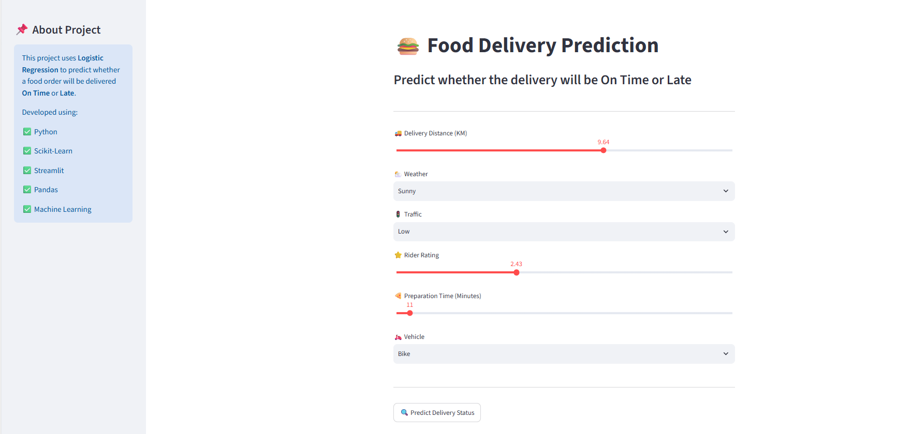
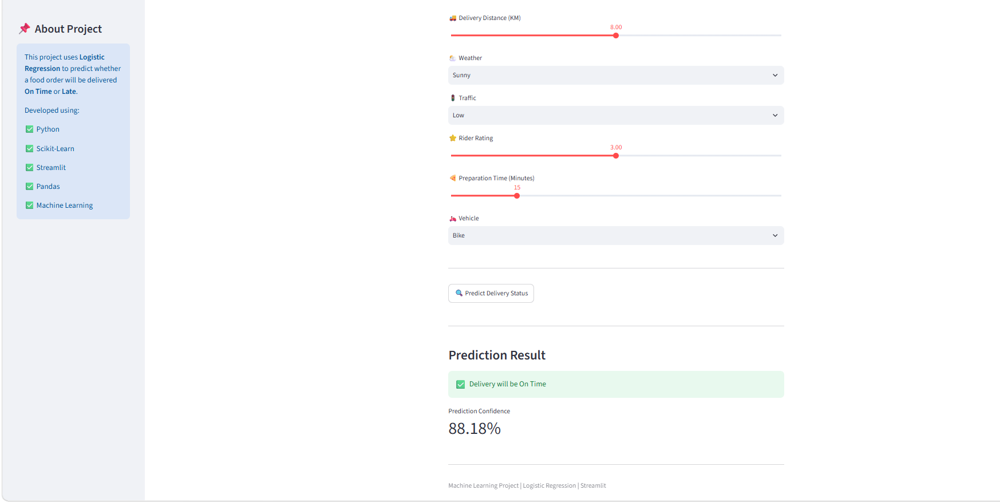
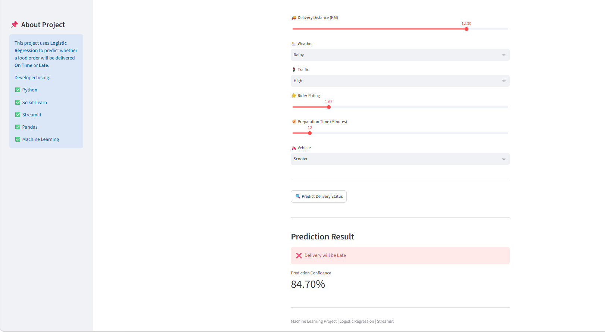

# 🍔 Food Delivery Prediction Using Machine Learning


An end-to-end Machine Learning project that predicts whether a food delivery will be **On Time** or **Late** using **Logistic Regression** and an interactive **Streamlit Web Application**.

---

# 🌐 Live Demo

👉 **https://food-delivery-predictor-using-ml.streamlit.app/**

---

# 💻 GitHub Repository

👉 **https://github.com/bodaleprathmesh-code/Food-Delivery-Prediction-Using-ML**

---

# 📌 Project Overview

This project predicts the delivery status of food orders based on various delivery-related factors such as delivery distance, weather conditions, traffic level, rider rating, preparation time, and vehicle type.

The project demonstrates the complete Machine Learning workflow, including data preprocessing, feature encoding, model training, model saving, and deployment using Streamlit.

---

# ✨ Features

- 🚀 Predict Food Delivery Status
- 🤖 Logistic Regression Model
- 📊 Interactive Streamlit Web App
- ⚡ Real-Time Prediction
- 📈 User-Friendly Interface
- 💾 Trained Model (.pkl)

---

# 🛠️ Technologies Used

- Python
- Pandas
- NumPy
- Scikit-learn
- Streamlit
- Pickle

---

# 📂 Project Structure

```text
Food-Delivery-Prediction-Using-ML
│
├── app.py
├── Train.py
├── food_delivery.csv
├── model.pkl
├── requirements.txt
├── README.md
│
└── images
    ├── home.png
    ├── prediction1.png
    └── prediction2.png
```

---

# 📊 Dataset Features

| Feature | Description |
|----------|-------------|
| Delivery Distance | Distance between restaurant and customer |
| Weather | Sunny, Cloudy, Rainy |
| Traffic | Low, Medium, High |
| Rider Rating | Delivery partner rating |
| Preparation Time | Food preparation time |
| Vehicle | Bike or Scooter |
| Delivery Status | On Time / Late |

---

# 🤖 Machine Learning Workflow

```text
Dataset
   │
   ▼
Data Preprocessing
   │
   ▼
Feature Encoding
   │
   ▼
Train-Test Split
   │
   ▼
Logistic Regression
   │
   ▼
Model Evaluation
   │
   ▼
Save Model (.pkl)
   │
   ▼
Streamlit Deployment
```

---

# 📸 Screenshots

## 🏠 Home Page

<p align="center">

</p>

---

## 📊 Prediction Result (On Time)

<p align="center">

</p>

---

## 📊 Prediction Result (Late)

<p align="center">

</p>

---

# 🚀 Installation

Clone the repository

```bash
git clone https://github.com/bodaleprathmesh-code/Food-Delivery-Prediction-Using-ML.git
```

Go to project directory

```bash
cd Food-Delivery-Prediction-Using-ML
```

Install dependencies

```bash
pip install -r requirements.txt
```

Run the application

```bash
streamlit run app.py
```

---

# 📈 Future Improvements

- Random Forest Model
- XGBoost Model
- Deep Learning Model
- Prediction Probability
- Better UI/UX
- Dashboard with Charts

---

# 🎯 Learning Outcomes

Through this project, I gained hands-on experience in:

- Data Preprocessing
- Feature Engineering
- Logistic Regression
- Machine Learning Workflow
- Streamlit Deployment
- GitHub Project Management

---

# 👨‍💻 Developer

## Prathmesh Bodale

🎓 Diploma in Information Technology

📊 Aspiring Data Scientist | Machine Learning Enthusiast

---

## ⭐ If you like this project, don't forget to give it a Star!
